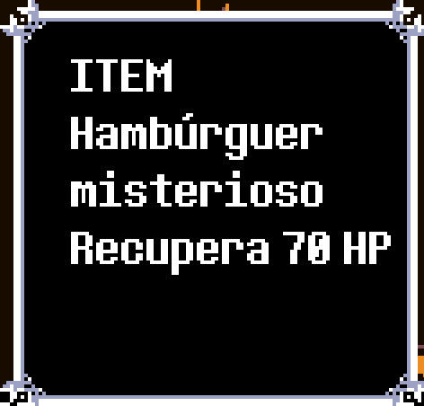
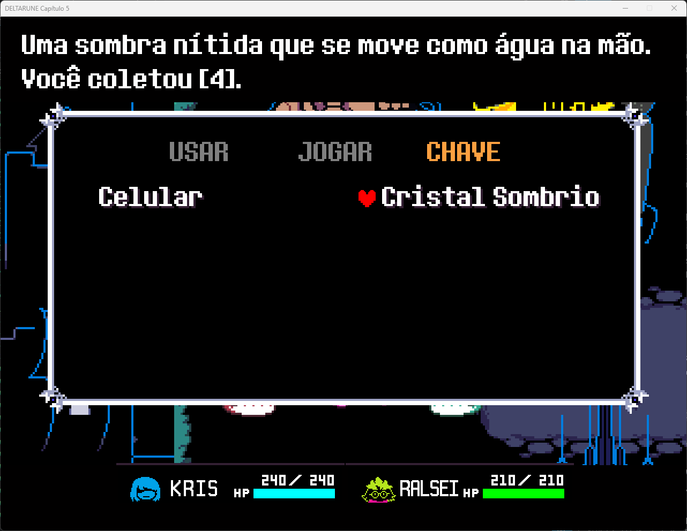
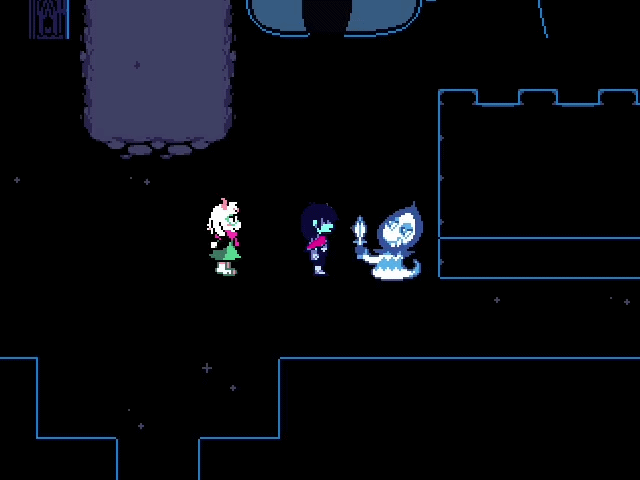
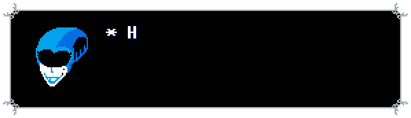

# Guia de Tradução
## Aviso
- Antes de tudo, precisamos deixar claro de que seguimos um padrão específico para tradução: usamos um `lang_xx.json` especial, no caso, `lang_pt.json`, esse arquivo NÃO EXISTE no jogo original. 
- Todas as `data.win` foram modificadas para fazer a variável `global.lang` suportar o valor `"pt"` (é o que define qual linguagem você escolheu ao iniciar um capítulo), consequentemente fazendo fallback para carregar o arquivo de idioma `"lang" + global.lang + ".json"`.
- Nomes de personagens não serão traduzidos.
- Priorize ao máximo manter a personalidade de cada personagem, como Ralsei ser formal, educado e às vezes tímido, Susie ser durona, falar com algumas gírias (ex: *cê*).

## Pontos a serem levados em conta...
- A tradução tem como base a tradução japonesa, que é a única tradução oficial, ou seja, possui exatamente as frases, nomes e outras cosias que o Toby Fox pensou e usaria em uma tradução, isso também vale para o código interno do jogo.
- Nomes de itens, equipamentos e armas terão os nomes **COMPLETOS**, e não abreviados/sem espaçamento *(ex: PinkRibbon)*.
- Sempre que for traduzir o nome de um inimigo, **verifique os pronomes dele na [Wiki](https://deltarune.wiki)**.
- Para se referir a Kris ou inimigos com gênero indefinido/pronomes neutros (*como Napstablook*), não utilize pronomes, use os seguintes exemplos para entender:
    - "Kris está cansado/cansada" → "Kris está com cansaço"
    - "O Pai do  Kris se chama Asgore" → "O pai de Kris se chama Asgore"

## Diálogos e as formatações

Toby Fox fez uma gambiarra bem legal e chata que é formatar o texto usando símbolos especiais, e cada um deles só funciona em certo momento, como em uma batalha, diálogo ou momento especial, esses são todos os símbolos, quando usá-los e exemplos.

### # (*Hashtag*)
- O símbolo "#" é usado para **pular linhas em INTERFACES e interfaces especiais**.
- Exemplos de uso:
    -   Interface de informação de item no shop: `"obj_shop1_slash_Create_0_gml_75_0": "ITEM#Hambúrguer#misterioso#Recupera 70 HP"`,
    -   Interface de informação de item/item-chave no inventário: `"scr_keyiteminfo_slash_scr_keyiteminfo_gml_70_0": "Uma sombra nítida que se move como água na mão.#Você coletou [~1].",` 

### ^X (*^ + número*)

- O símbolo "^X" é usado para **dar o efeito de pausa na fala do personagem em diálogos**, sendo o número a quantidade em milissegundos que o writer espera antes de continuar a escrever o diálogo.
- Exemplos de uso:
    -   `"* Blue^1, blue^1, blue-be-doo^1. Was your love true?"` 
- Funciona em qualquer interface que use este parâmetro.

### & (*esperluette*)

- Este símbolo cumpre o mesmo papel da "#" [*hashtag*](#-hashtag), porém em diálogos (diálogos de batalha também).

### "/" (*barra*) e "/%" (*barra e porcentagem*)

- Existem duas ocasiões em que apenas a barra é usada e quando a barra E porcentagem são usadas.
- A barra e porcentagem indicam que será o último diálogo de tal personagem e, quando o jogador pressionar Z/Enter, o diálogo pode ser fechado.
- Diálogos que possuem apenas a barra indica que é uma sequência de diálogo de certo personagem e que terá outra fala depois dela.
- Exemplo de sequência:
    - `"obj_npc_room_slash_Other_10_gml_160_0": "* (I'm Goulden Sam.)/",
  "obj_npc_room_slash_Other_10_gml_161_0": "* (I'm going to be a proud mother or father one day.)/%",`

### "\\EX" (*portrait*)
- O símbolo "**\\E(letra)**" significa que o respectivo diálogo possui a face de um personagem, e não apenas o diálogo.
    - Exemplo: `\\E0* Hmm^1, Sim^1, Sim^1, Medidas Interessantes/`

- A letra após a letra "E" significa qual expressão o personagem fará, se é de medo, raiva, tristeza, etc.

## Como saber se um diálogo cabe na textbox...

- Bem simples, o [site do Demirramon](https://www.demirramon.com/generators/undertale_text_box_generator) ajuda muito nisso, basta abrir, selecionar o tipo de box, o portrait do personagem, colocar a mensagem (sem a formatação, o site aplica sozinho) e pronto!

- <video controls src="/demonstraçao.mp4" title="Title"></video>